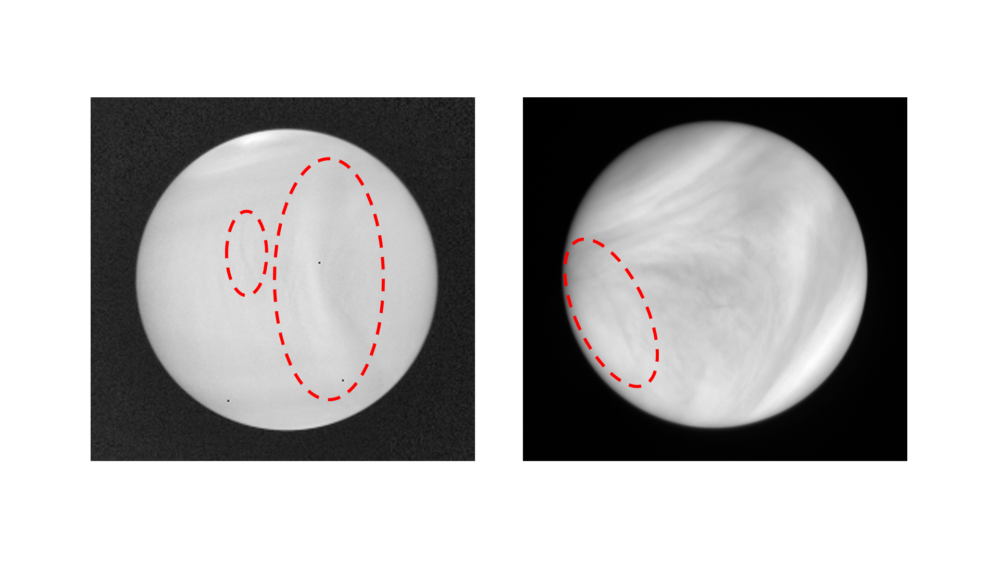

# Stationary Wave Detection and Localization
This repository contains the code for our paper, titled "Detection and Localization of Stationary Waves on Venus Using a Self-Supervised Anomaly Detection Model".

## System Requirements and Setup
We run our experiments in Ubuntu 20.04 using Nvidia A100 GPU.
To set up and use the required environment for this project, follow these steps:

1. **Create the Conda environment:**
   ```bash
   conda create -n venus_waves python=3.9

2. **Activate the environment:**
   ```bash
   conda activate venus_waves

3. **Install the required libraries:**
   ```bash
   pip install -r requirements.txt

## Training 
Prepare the dataset using the preprocessing step below:
```bash
python data_preprocessing.py --input_dir path/to/input --output_dir path/to/output --workers 4 --datatype uvi_or_lir
```

If you would like to crop your grids from images, you can use our grid_cropper_UI.py script.

An example of the model training script can be seen below:
```bash
CUDA_VISIBLE_DEVICES=0 python -m torch.distributed.run \
    --nproc_per_node=1 \
    --nnodes=1 \
    --master_port=12345 \
    multigpu_train.py \
    --data_path /path/to/your/dataset \
    --experiment_type YourExperimentType \
    --gpus '0'
```
If you would like to utilize multiple GPUs, an example script can be seen below:
```bash
CUDA_VISIBLE_DEVICES=2,3 python -m torch.distributed.run \
    --nproc_per_node=2 \
    --nnodes=1 \
    --master_port=12345 \
    multigpu_train.py \
    --data_path /path/to/your/dataset \
    --experiment_type YourExperimentType \
    --gpus '0,1'
```
## Testing 

## Citation

## Acknowledgements
